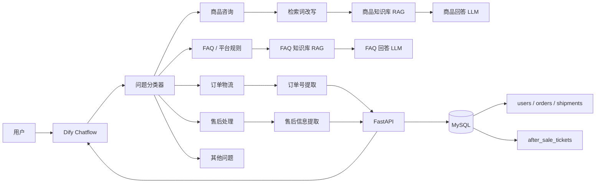

# 基于 Dify + FastAPI + MySQL 的电商智能客服与售后工单系统

这是一个基于 Dify 工作流、RAG 知识库、FastAPI 和 MySQL 实现的电商智能客服项目。

项目将静态商品知识、平台 FAQ 与动态订单数据分离处理：
- 商品信息和 FAQ 使用 Dify RAG 知识库进行检索问答
- 订单及物流信息通过 FastAPI + MySQL 实时查询
- 服务端进行订单归属校验，避免越权查询其他用户订单
- 售后场景支持识别退货、退款、换货、补发等诉求，并创建售后工单

## 技术栈

- Dify
- FastAPI
- MySQL
- SQLAlchemy
- Docker
- Python
- RAG / Embedding / Rerank
- Git

## 系统架构



## 项目结构

```text
AI_Project/
├─ app/
│  ├─ __init__.py
│  ├─ config.py          # 环境变量与项目配置
│  ├─ db.py              # SQLAlchemy 数据库连接
│  ├─ main.py            # FastAPI 接口与应用入口
│  └─ models.py          # 数据库模型
│
├─ data/
│  └─ raw/
│     └─ order_tracking_table.xlsx
│
├─ dify/
│  └─ ecommerce_customer_service_mvp.yml
│
├─ scripts/
│  ├─ create_tables.py
│  └─ import_order_tracking.py
│
├─ .env.example
├─ .gitignore
├─ requirements.txt
├─ README.md
└─ versions.md
```

## MVP 已实现功能

- 商品知识库问答
- 商品推荐与检索词改写
- 电商 FAQ 问答
- 用户意图分类
- 订单状态查询
- 物流信息查询
- 订单归属权限校验
- 售后意图识别
- 售后类型与问题类型提取
- 售后订单归属校验
- 售后工单创建
- Dify → FastAPI HTTP 调用
- HTTP 异常与失败分支处理

## 当前版本

`v0.1.0`

当前版本为第一版可运行 MVP，已完成商品咨询、FAQ、订单物流查询和售后工单创建的完整业务闭环。

## 订单物流 Excel 导入（MVP）

在项目根目录激活虚拟环境，并确认 `.env` 中数据库配置正确后执行：

```powershell
python -m scripts.import_order_tracking data/raw/order_tracking_table.xlsx
```


## API 接口

FastAPI 启动后，可以通过 Swagger 查看完整接口文档：

```text
http://127.0.0.1:8000/docs
```

### 健康检查

```http
GET /health/live
GET /health/ready
```

用于检查 FastAPI 服务及数据库连接状态。

### 查询订单与物流

```http
GET /api/v1/orders/{order_no}
```

示例：

```http
GET /api/v1/orders/TB2601021234567
```

当前 MVP 使用服务端环境变量：

```env
DEMO_USER_ID=1
```

模拟当前登录用户。

订单查询会同时校验：

```text
order_no + 当前用户 ID
```

如果订单不存在或不属于当前用户，统一返回：

```json
{
  "detail": "未找到可访问的订单"
}
```

避免泄露其他用户的订单信息。

### 创建售后工单

```http
POST /api/v1/after-sales
```

请求示例：

```json
{
  "order_no": "TB2601021234567",
  "request_type": "reship",
  "issue_type": "missing",
  "reason": "少发了一件，希望补发"
}
```

`request_type` 支持：

```text
return    退货
refund    退款
exchange  换货
reship    补发
other     其他
```

`issue_type` 支持：

```text
damaged     商品破损
missing     少件 / 漏发
wrong_item  发错商品
quality     质量问题
no_issue    未描述商品问题
other       其他问题
```

创建成功示例：

```json
{
  "ticket_id": 3,
  "order_no": "TB2601021234567",
  "request_type": "reship",
  "issue_type": "missing",
  "reason": "少发了一件，希望补发",
  "status": "pending",
  "created_at": "2026-09-19T07:37:44"
}
```

售后接口同样由服务端校验订单归属，不接收客户端提供的 `user_id`。

## 核心业务流程

### 1. 商品咨询

```text
用户问题
→ 问题分类器
→ 商品咨询
→ 检索词改写
→ 商品知识库检索
→ 商品回答 LLM
→ 返回答案
```

商品静态信息存放在 Dify 知识库中，通过 RAG 完成商品属性问答和推荐。

### 2. FAQ / 平台规则

```text
用户问题
→ 问题分类器
→ FAQ / 平台规则
→ FAQ 知识库检索
→ FAQ 回答 LLM
→ 返回答案
```

用于处理发货时效、退款规则、退换货政策等通用问题。

### 3. 订单与物流查询

```text
用户问题
→ 问题分类器
→ 订单物流
→ 提取订单号
→ FastAPI 查询订单
→ 服务端校验订单归属
→ MySQL 查询订单与物流
→ 整理为自然语言回复
```

订单不存在或不属于当前用户时，统一返回“未找到可访问的订单”。

### 4. 售后处理

```text
用户问题
→ 问题分类器
→ 售后处理
→ 提取订单号 / 售后方式 / 问题类型 / 原因
→ 校验订单归属
→ FastAPI 创建售后工单
→ MySQL 保存工单
→ 返回工单编号和状态
```

当前 MVP 支持识别：

- 退货
- 退款
- 换货
- 补发
- 商品破损
- 少件 / 漏发
- 发错商品
- 质量问题

## 项目亮点与设计思路

### 1. 静态知识与动态数据分离

商品资料和平台 FAQ 属于相对静态的信息，使用 Dify 知识库进行 RAG 检索。

订单、物流和售后工单属于动态业务数据，统一通过 FastAPI + MySQL 查询和写入。

这样可以避免把实时变化的数据直接放进知识库。

### 2. Dify 负责理解，FastAPI 负责业务规则

Dify 主要负责：

- 用户意图分类
- 商品与 FAQ 知识检索
- 检索词改写
- 订单号和售后参数提取
- 工作流编排
- 自然语言回复

FastAPI 主要负责：

- 订单查询
- 订单归属校验
- 物流数据查询
- 售后工单创建
- 业务参数校验

### 3. 服务端订单归属校验

当前 MVP 使用 `DEMO_USER_ID` 模拟登录用户。

订单查询和售后处理都由服务端使用：

```text
order_no + 当前用户 ID
```

进行联合校验。

如果订单不存在或不属于当前用户，统一返回：

```text
未找到可访问的订单
```

避免向客户端泄露其他用户的订单信息。

### 4. 售后信息结构化

售后场景不仅保存用户自然语言原因，还会提取：

```text
request_type
issue_type
reason
```

例如：

```text
“少发了一件，我想补发”
```

可以结构化为：

```json
{
  "request_type": "reship",
  "issue_type": "missing",
  "reason": "少发了一件，希望补发"
}
```

为后续扩展不同售后处理流程预留结构化数据。

### 5. 异常分支处理

Dify 工作流中对 HTTP 调用配置了失败分支。

针对订单不存在、无权访问、接口异常等情况，不直接向用户暴露后端错误信息，而是返回统一、自然的客服提示。

### 6. 可复现的工作流配置

Dify 工作流已导出为 DSL：

```text
dify/ecommerce_customer_service_mvp.yml
```

便于项目迁移、版本管理和 GitHub 展示。

## 快速启动

### 1. 创建虚拟环境

```powershell
python -m venv .venv
```

### 2. 激活虚拟环境

```powershell
.\.venv\Scripts\Activate.ps1
```

### 3. 安装依赖

```powershell
pip install -r requirements.txt
```

### 4. 配置环境变量

复制 `.env.example` 为 `.env`：

```powershell
Copy-Item .env.example .env
```

然后在 `.env` 中填写 MySQL 配置：

```env
APP_ENV=development

DB_HOST=127.0.0.1
DB_PORT=3306
DB_USER=root
DB_PASSWORD=你的数据库密码
DB_NAME=你的数据库名

DEMO_USER_ID=1
```

当前 MVP 使用 `DEMO_USER_ID` 模拟已登录用户。

### 5. 创建数据库表

```powershell
python -m scripts.create_tables
```

### 6. 导入订单物流测试数据

```powershell
python -m scripts.import_order_tracking data/raw/order_tracking_table.xlsx
```

### 7. 启动 FastAPI

```powershell
python -m uvicorn app.main:app --reload --host 0.0.0.0 --port 8000
```

启动后可访问：

```text
http://127.0.0.1:8000/docs
```

### 8. 导入 Dify 工作流

Dify DSL 文件：

```text
dify/ecommerce_customer_service_mvp.yml
```

在 Dify 中导入 DSL 后，需要根据自己的环境重新配置：

- 模型供应商
- 商品知识库
- FAQ 知识库
- Embedding / Rerank 模型
- HTTP 节点地址

本项目使用本地 Docker 部署 Dify 时，Dify 调用宿主机 FastAPI 的地址为：

```text
http://host.docker.internal:8000
```
> 如果本地 Docker 中的 Dify 无法访问 `host.docker.internal:8000`，可先检查 VPN、代理软件或网络路由设置；本项目测试中关闭 VPN 后可正常访问。


## 后续计划

当前 `v0.1.0` 已完成商品咨询、FAQ、订单物流查询和售后工单创建的 MVP 闭环。

后续可以继续扩展：

- 接入真实登录 / JWT 鉴权，替换当前 `DEMO_USER_ID`
- 增加售后工单查询与状态流转
- 根据 `request_type` 和 `issue_type` 实现不同售后处理规则
- 增加商品价格、库存等动态数据接口
- 引入 Alembic 管理数据库迁移
- 增加自动化测试与接口测试
- 增加 Docker Compose 一键启动
- 完善日志、监控与异常追踪
- 增加前端客服聊天界面
- 优化 RAG 召回、重排与评测流程