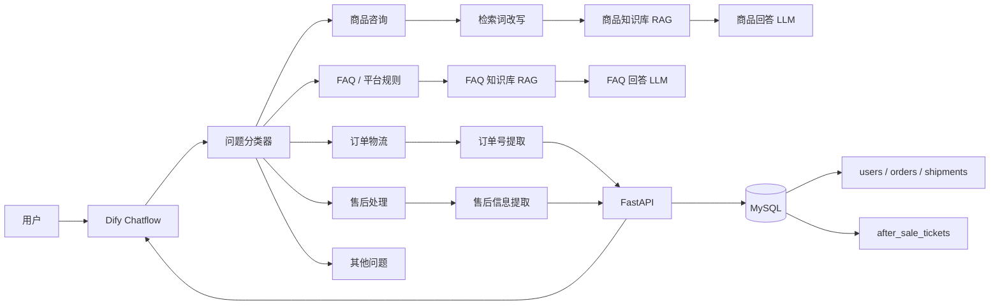

# 基于 Dify + FastAPI + MySQL 的电商智能客服与售后工单系统

这是一个基于 Dify 工作流、RAG 知识库、FastAPI 和 MySQL 实现的电商智能客服项目。

项目将静态商品知识、平台 FAQ 与动态订单数据分离处理：
- 商品信息和 FAQ 使用 Dify RAG 知识库进行检索问答
- 订单及物流信息通过 FastAPI + MySQL 实时查询
- 服务端进行订单归属校验，避免越权查询其他用户订单
- 售后场景支持识别退货、退款、换货、补发等诉求，并创建售后工单

## 技术栈

- Dify
- FastAPI
- MySQL
- SQLAlchemy
- Docker
- Python
- RAG / Embedding / Rerank
- Git

## 系统架构


## MVP 已实现功能

- 商品知识库问答
- 商品推荐与检索词改写
- 电商 FAQ 问答
- 用户意图分类
- 订单状态查询
- 物流信息查询
- 订单归属权限校验
- 售后意图识别
- 售后类型与问题类型提取
- 售后订单归属校验
- 售后工单创建
- Dify → FastAPI HTTP 调用
- HTTP 异常与失败分支处理

## 当前版本

`v0.1.0`

当前版本为第一版可运行 MVP，已完成商品咨询、FAQ、订单物流查询和售后工单创建的完整业务闭环。

## 订单物流 Excel 导入（MVP）

在项目根目录激活虚拟环境，并确认 `.env` 中数据库配置正确后执行：

```powershell
python -m scripts.import_order_tracking data/raw/order_tracking_table.xlsx
```
## 快速启动

### 1. 创建并激活虚拟环境

```powershell
python -m venv .venv
.\.venv\Scripts\Activate.ps1
```